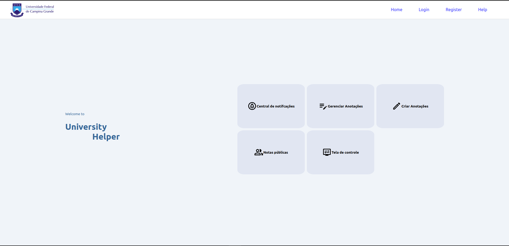
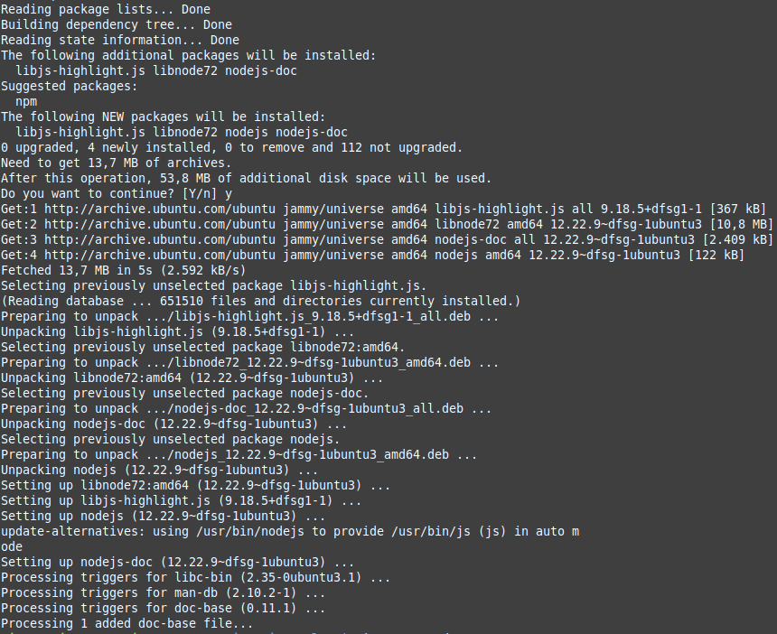
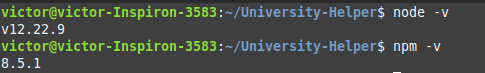

# University Helper

O University Helper, é uma solução desenvolvida por um grupo de alunos da disciplina de PLP, para enfrentar os desafios persistentes do ambiente universitário. Afinal, organizar suas informações, lembretes, anotações, entre outras coisas, exige uma boa organização. Além disso, ter um ambiente de comunicação entre alunos e professores é imprescindível. Então que tal algo mais global?



## Objetivo

Nosso objetivo é transformar a experiência universitária, proporcionando aos estudantes uma plataforma integrada e eficiente que simplifica tarefas, otimiza o tempo e promove um ambiente colaborativo de aprendizado. Com o University Helper, você terá acesso a ferramentas poderosas para gerenciar sua rotina acadêmica, como a criação e compartilhamento de anotações essenciais.

Não deixe que os obstáculos burocráticos e a falta de integração atrapalhem sua jornada acadêmica. Experimente o University Helper e descubra como podemos tornar sua experiência universitária excepcional.

## Configuração da ferramenta em seu dispositivo

Há 2 coisas que você precisa configurar antes de poder desfrutar da nossa ferramenta com total poder, iremos explicar abaixo como manter cada seção funcionando perfeitamente.

### Frontend

Uma boa interface para o usuário é muito importante para que uma ferramenta se mantenha em uso nos dias de hoje, por isso, criamos um frontend como uma casca, não há lógica nele a não ser requisições http para nossa API do University Helper

Sem mais delongas, vamos ao tutorial de instalação.

#### Instalando e configurando o npm

1. Abra o seu terminal e digite o comando abaixo para atualizar o repositório do seu sistema com as mais novas informações sobre os pacotes e suas versões.

    ```bash
    sudo apt update
    ```

2. Após o comando de cima ter sido executado, instale o Node.js com o seguinte comando:

    ```bash
    sudo apt-get install nodejs
    ```

    Confirme a instalação, digitando "y" e pressionando a tecla Enter no terminal. Algo similar a imagem a seguir deve aparecer na sua tela:

    
    [Link para o arquivo de texto da imagem acima](docs/sudo-apt-install-nodejs.txt)

3. Instale também o gerenciador de pacotes do Node.js (npm) executando o seguinte comando:

    ```bash
    sudo apt install npm
    ```

    OBS: Lembre-se de confirmar a instalação!

    [Link para o arquivo de texto com os logs do comando acima](docs/sudo-apt-install-npm.txt)

4. Depois disso, verifique se a instalação do Node.js e do npm com os seguintes comandos:

    ```bash
    node -v
    npm -v
    ```

    Seu terminal deve apresentar as versões dos pacotes instalados de forma similar a imagem abaixo:

    

    Se estiver tudo certo, poderemos seguir para a próxima etapa. Senão, veja mais informações no [site oficial do Node.js](https://nodejs.org/en/learn/getting-started/how-to-install-nodejs).

### API Prolog

O University Helper possui uma API em Prolog para lidar com as requisições do usuário. Para executá-la é necessário que a ferramenta, [SWI-Prolog](https://www.swi-prolog.org/download/stable), esteja devidamente instalada.

#### Instalando e configurando o SWI-Prolog

1. Acesse o link a seguir: https://www.swi-prolog.org/download/stable.

2. Siga as instruções no link acima e instale uma versão estável do SWI-Prolog.

### Executando a aplicação

#### Executando a API Prolog

1. Em um terminal, navegue para a raíz do projeto University Helper, utilizando o seguinte comando e lembrando de substituir *path/To/UniversityHelper* com o caminho correto:

    ```bash
    cd path/To/University-Helper
    ```

2. Execute-o com o SWI-Prolog, utilizando o comando:

    ```bash
    swipl -s backend/app/main.pl 
    ```

    Com isso, a API Prolog estará rodando em plano de fundo.

#### Executando o front-end React

1. Em outro terminal, navegue para a pasta *frontend/* dentro da raíz do projeto, usando algo similar ao comando abaixo:

    ```bash
    cd pathToUniversityHelper/frontend
    ```

2. Instale as dependências do projeto com o NPM, executando:

    ```bash
    npm install
    ```

3. Execute a interface do usuário com o seguinte comando:

    ```bash
    npm start
    ```

    Espere até que abra uma nova página na web, caso isso não aconteça e o servidor já tenha subido, acesse o [localhost](localhost:3000).